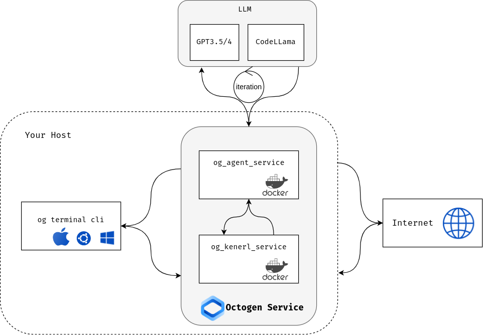

Getting Started
===============

Octogen is an Open-Source Code Interpreter Powered by GPT 3.5/4 and Codellama.

Requirements
------------

Octopus works with macOs, Linux and Windows.
Octopus requires the following enviroment

- Python 3.10.0 and above.
- `Pip <https://pip.pypa.io/en/stable/installation/>`_
- `Docker Desktop 24.0.0 and above <https://www.docker.com/products/docker-desktop/>`_  or `Podman <https://podman.io/docs/installation>`_

To use codellama, your host must have at least 8 CPUs and 16 GB of RAM

Install
-------

the first step, install ``og_up`` tool::

    $ pip install og_up

the second step, use ``og_up`` to setup the octopus service and cli::

    $ og_up

You have the option to select from 

- OpenAI, `apply <https://platform.openai.com/account/api-keys>`_ the openai api key
- Azure OpenAI, `apply <https://azure.microsoft.com/en-us/products/ai-services/openai-service>`_ the azure api key
- CodeLlama
- Octogen(beta) agent services, `apply <https://www.octogen.dev/>`_ the octogen agent service key

the default is using docker as container engine, use podman with flag ``--use_podman``

If you opt for CodeLlama, Octogen will automatically download it from huggingface.co. 
In case the installation of the Octogen Terminal CLI is taking longer than expected, 
you might want to consider switching to a different pip mirror.

the third step, open your terminal and execute the command ``og``, you will see the following output::

    Welcome to use octogen❤️ . To ask a programming question, simply type your question and press esc + enter
    You can use /help to look for help

    [1]🎧>

How to use
----------

just type the question and  press ``esc + enter`` to get the answer, if you want to know more function just type ``/help`` + ``esc+enter``::

   [1]🎧>/help
                                                                                           Keyboard Shortcut:

  • ESC + ENTER: Submit your question to Octogen or execute your command.

                                                                                               Commands:

  • /clear: Clears the screen.
  • /cc{number}: Copies the output of Octogen to your clipboard.
  • /exit: Exits the Octogen CLI.
  • /up: Uploads files from your local machine; useful for including in your questions.
  • /assemble {name} {number1} {number2}: Assembles the specified code segments into an application.
  • /run {name}: Executes an application with the specified name.
  • /apps: Displays a list of all your apps.

                                                                                               Need Help?

  1 Create an issue on our GitHub page: Octogen GitHub Issues
  2 Alternatively, you can email us at codego.me@gmail.com.

How it works
------------

- Octogen Kernel: The code execution engine, based on notebook kernels.
- Octogen Agent: Manages client requests, uses ReAct to process complex tasks, and stores user-assembled applications.
- Octogen Terminal Cli: Accepts user requests, sends them to the Agent, and renders rich results. Currently supports Discord, iTerm2, and Kitty terminals.

